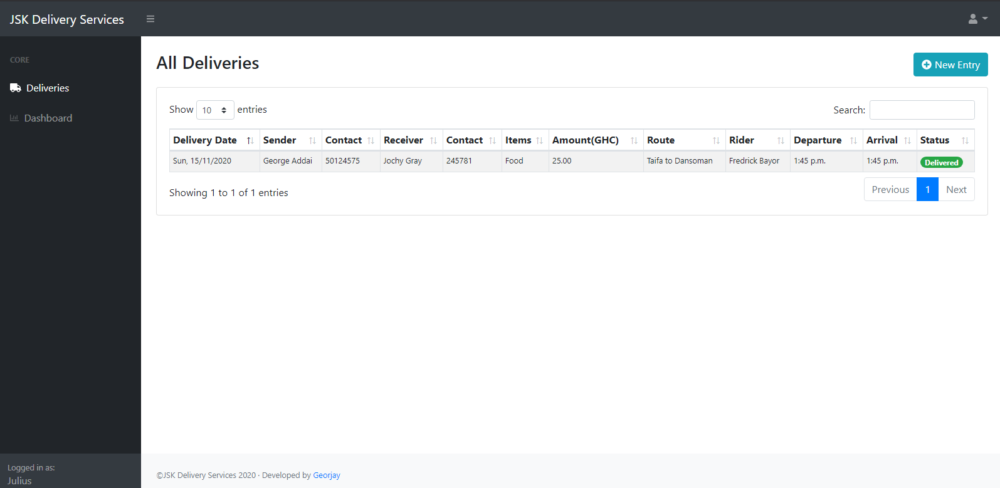
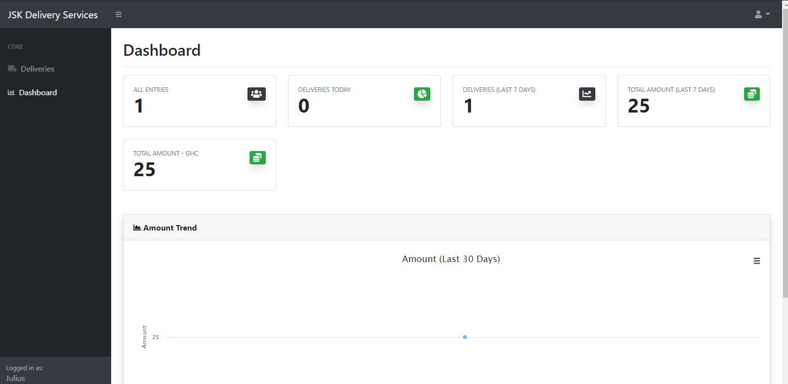
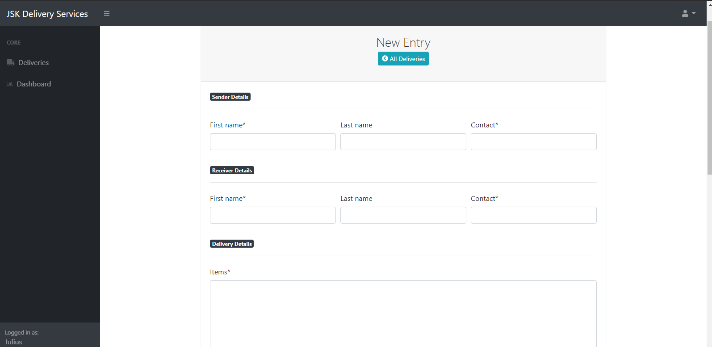

# jsk-delivery-services

This Django Web Application is a customer database management system developed for a delivery business known as JSK Delivery Services. It also provides a dashboard which presents a summary (statistics) of the day-to-day delivery activities of JSK.

## Screenshots

